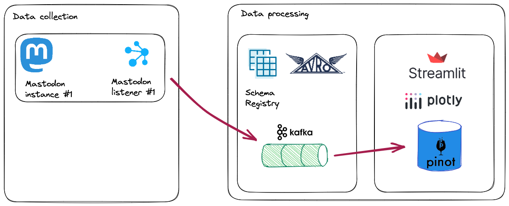

# Mastodon usage - counting toots with Apache Pinot  

[Mastodon](https://joinmastodon.org/) is a _decentralized_ social networking platform. Mastodon users are members of a _specific_ Mastodon server, and servers are capable of joining other servers to form a global (or at least federated) social network.

I wanted to start exploring Mastodon usage, and perform some exploratory data analysis of user activity, server popularity and language usage. You may want to jump straight to the [data analysis](#data-analysis)

Tools used
- [Mastodon.py](https://mastodonpy.readthedocs.io/) - Python library for interacting with the Mastodon API
- [Apache Kafka](https://kafka.apache.org/) - distributed event streaming platform
- [Apache Pinot](https://dev.startree.ai/docs/pinot/recipes/) - Real-Time OLAP database
- [Streamlit](https://streamlit.io/) - Python web framework




# Data processing
We will us Kafka as distributed stream processing platform to collect data from multiple instances. To run Kafka, Kafka Connect (with the S3 sink connector) and schema registry (to support AVRO serialisation) and MinIO setup containers with this command

```console
 docker-compose up -d
 ```

# Data collection

## Setup virtual python environment
Create a [virtual python](https://packaging.python.org/en/latest/guides/installing-using-pip-and-virtual-environments/) environment to keep dependencies separate. The _venv_ module is the preferred way to create and manage virtual environments. 

 ```console
python3 -m venv env
```

Before you can start installing or using packages in your virtual environment you’ll need to activate it.

```console
source env/bin/activate
pip install --upgrade pip
pip install -r requirements.txt
 ```


## Federated timeline
These are the most recent public posts from people on this and other servers of the decentralized network that this server knows about.

## Mastodon listener
The python `mastodonlisten` application listens for public posts to the specified server, and sends each toot to Kafka. You can run multiple Mastodon listeners, each listening to the activity of different servers

```console
python mastodonlisten.py --baseURL https://mastodon.social --enableKafka
```

These ones create a reasonable amount of messages:

```console

python mastodonlisten.py --baseURL https://fosstodon.org/ --public --enableKafka --quiet
python mastodonlisten.py --baseURL https://mstdn.social/ --public --enableKafka --quiet
python mastodonlisten.py --baseURL https://mastodon.cloud/ --public --enableKafka --quiet
python mastodonlisten.py --baseURL https://mas.to/ --public --enableKafka --quiet
python mastodonlisten.py --baseURL https://universeodon.com --public --enableKafka --quiet
python mastodonlisten.py --baseURL https://masto.ai/ --public --enableKafka --quiet
```

## Testing producer (optional)
As an optional step, you can check that AVRO messages are being written to kafka

```console
kafka-avro-console-consumer --bootstrap-server localhost:9092 --topic mastodon-topic --from-beginning
```

```console
kcat -C -b localhost:9092 -t mastodon-topic -s value=avro -r http://localhost:8081 -e
```

## Pinot

```bash
docker run \
   --network mastodon \
   -v $PWD/pinot:/config \
   apachepinot/pinot:0.12.0-arm64 AddTable \
     -schemaFile /config/schema.json \
     -tableConfigFile /config/table.json \
     -controllerHost "pinot-controller" \
    -exec
```

# Data analysis
Now we have collected a week of Mastodon activity, let's have a look at some data. These steps are detailed in the [notebook](./notebooks/mastodon-analysis.ipynb)


## Query parquet files directly from s3 using DuckDB

Load the [HTTPFS DuckDB extension](https://duckdb.org/docs/extensions/httpfs.html) for reading remote/writing remote files of object storage using the S3 API

```console
INSTALL httpfs;
LOAD httpfs;

set s3_endpoint='localhost:9000';
set s3_access_key_id='minio';
set s3_secret_access_key='minio123';
set s3_use_ssl=false;
set s3_url_style='path';
```

And you can now query the parquet files directly from s3

```sql
select *
from read_parquet('s3://mastodon/topics/mastodon-topic/partition=0/*');
```


## Daily Mastodon usage

We can query the `mastodon_toot` table directly to see the number of _toots_, _users_ each day by counting and grouping the activity by the day

We can use the [mode](https://duckdb.org/docs/sql/aggregates.html#statistical-aggregates) aggregate function to find the most frequent "bot" and "not-bot" users to find the most active Mastodon users

## The Mastodon app landscape
What clients are used to access mastodon instances. We take the query the `mastodon_toot` table, excluding "bots" and load query results into the `mastodon_app_df` Panda dataframe. [Seaborn](https://seaborn.pydata.org/) is a visualization library for statistical graphics  in Python, built on the top of [matplotlib](https://matplotlib.org/). It also works really well with Panda data structures.


## Time of day Mastodon usage
Let's see when Mastodon is used throughout the day and night. I want to get a raw hourly cound of _toots_ each hour of each day. We can load the results of this query into the `mastodon_usage_df` dataframe


## Language usage
A wildly inaccurate investigation of language tags


## Language density
A wildly inaccurate investigation of language tags


# Optional steps


## Cleanup of virtual environment
If you want to switch projects or otherwise leave your virtual environment, simply run:

```console
deactivate
```

If you want to re-enter the virtual environment just follow the same instructions above about activating a virtual environment. There’s no need to re-create the virtual environment.

## Debugging

http://localhost:8081/schemas/latest_with_type=mastodon-topic-value
http://localhost:8081/schemas?latest_with_type=mastodon-topic-value
https://github.com/apache/pinot/issues/9990

https://itsfoss.com/best-mastodon-instances/#1-fosstodon

https://betterprogramming.pub/mastodon-usage-counting-toots-with-kafka-duckdb-seaborn-42215c9488ac
